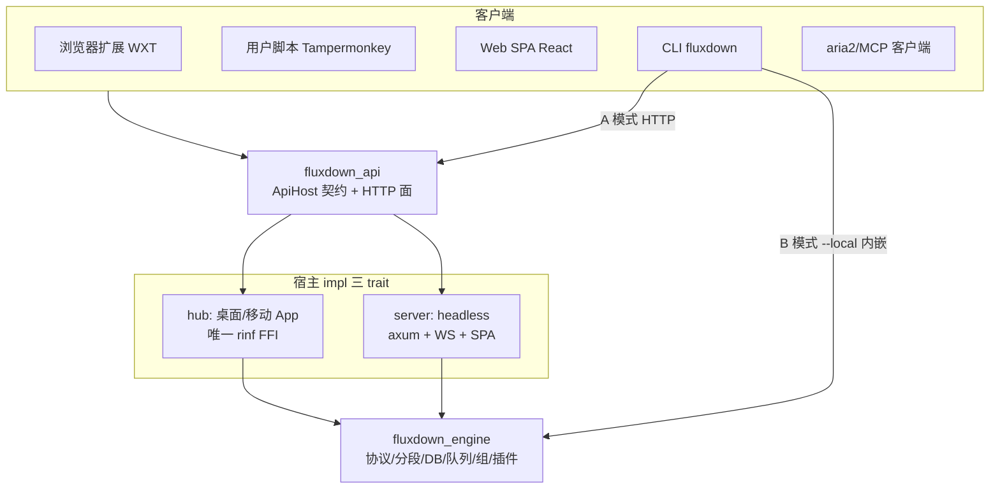

# FluxDown — 项目知识库

**应用名称**: FluxDown（多协议下载管理器，IDM 免费替代品）
**官网**: https://fluxdown.zerx.dev
**当前版本**: 0.1.44（见 `pubspec.yaml`）
**技术栈**: 一套 Rust 下载引擎（`fluxdown_engine`）+ 多个宿主/客户端：Flutter 桌面与移动 App、headless Web 服务器、CLI、WXT 浏览器扩展、Tampermonkey 用户脚本、JS 插件系统、内置 MCP/REST/aria2 API、React Web SPA。
**FFI 框架**: [Rinf 8.10](https://rinf.cunarist.org)（Dart↔Rust 信号通信，bincode 序列化）——**仅** Flutter App（`hub` crate）用到 rinf。

---

## 0. 如何维护本文档（务必先读）

本文档描述**架构缝（seam）、不变式（invariant）、扩展点（extension point）**，而不是逐文件清单。目的：改一个文件不必来更新本文档，只有**架构/契约/不变式变化**时才更新。

维护约定：
- **不要**在这里维护"完整文件清单""完整设置项清单"这类会随每次提交漂移的枚举。需要文件级信息时，用 `read <dir>`（目录结构）或 grep 源码——源码是唯一事实源。
- 每个子系统只记录：**职责边界、关键不变式、"要加 X 应该改哪里"**。
- 事实层面（版本号、协议数、路由组、env 变量、DB 表）以代码为准；本文档给出的是索引与坐标，不是副本。
- 单一事实源坐标：设置键→`models/settings_provider.dart` 的 load switch + 引擎 `db.rs config` 表；HTTP 契约→`native/api`；DB schema→`native/engine/src/db.rs`；Rust↔Dart 信号→`native/hub/src/signals/mod.rs`。

---

## 1. 产品定位

> **"Downloads, Supercharged."**（下载，全面加速。）

- **核心价值主张**: Rust 驱动的高速多协议下载，永久免费，零广告，零追踪（仅两条匿名部署遥测，可关），本地优先，无需账号即可全功能使用。
- **平台矩阵（已发布）**: Windows / macOS / Linux 桌面 App、Android App、headless Web 服务器（Docker/群晖/QNAP/OpenWrt/Unraid/CasaOS）、CLI（`fluxdown`）、浏览器扩展、用户脚本。iOS 代码存在但无发布 job。
- **可选云能力（FluxCloud）**: 登录账号后跨设备**配置同步**（客户端已落地，见 §12）；下载本身永远本地，账号非必需。

---

## 2. 命令速查

```bash
# ── 代码生成（改 Rust 信号后必须）──
rinf gen                              # 生成 Dart 绑定（lib/src/bindings 自动生成，勿手改）

# ── 构建 / 静态检查 ──
cargo check -p <crate> --lib          # 验证编译优先按 crate（不要整 workspace）
cargo fmt --check && cargo clippy -- -D warnings   # 提交前必过
flutter analyze                       # Dart 静态分析
# flutter run -d windows              # ⚠️ 禁止运行此命令

# ── 测试（按 crate/过滤，不要 --workspace）──
cargo nextest run -p fluxdown_engine <filter>   # 引擎单测（协议/分段/DB）
cargo test -p fluxdown_api            # HTTP API（axum/aria2/MCP/OpenAPI 漂移守卫）
cargo test -p fluxdown_server         # headless server（WS/actor/扩展路由）
cargo test -p fluxdown_cli            # CLI（退出码/尺寸解析 doctest）
flutter test                          # Dart 测试
PG_TEST_URL=postgres://postgres:pw@localhost/postgres cargo test -p fluxdown_engine -- --ignored pg_smoke
# 插件相关（feature 门控）：
cargo test -p fluxdown_engine --features plugins,components --test plugin_ffmpeg   # 真实执行经 FLUXDOWN_TEST_FFMPEG=<abs> 注入
cargo test -p fluxdown_engine --features plugins,components --test plugin_ytdlp    # FLUXDOWN_TEST_YTDLP=<abs>
cargo check -p fluxdown_engine        # 不带 feature：验证 mobile 关插件时主链路零变化

# ── 各宿主/客户端运行 ──
cargo run -p fluxdown_server          # headless 服务器（见 §11 env）
cargo run -p fluxdown_cli -- ping     # CLI 探活（子命令见 §10）
cargo run -p fluxdown_cli -- add <url> --local   # B 模式：内嵌引擎独立下载

# ── 前端/官网/扩展 ──
cd web && bun run dev                 # Web SPA localhost:5173（/api 代理到 :17800）；bun run build → web/dist
cd website && npm run dev             # 官网 Astro localhost:4321
cd fluxDown && npm run dev            # 扩展开发（Chrome）；dev:firefox / build / zip

# ── OpenAPI / 图标 / 发布 ──
cargo run -p fluxdown_api --example gen_openapi > website/public/openapi.json   # 改 API 后重生成
bun scripts/gen_icons.ts              # 改 assets/logo/fluxdown_logo.svg 后全平台图标一键生成
git tag -a vX.Y.Z -m "vX.Y.Z" && git push origin vX.Y.Z   # 触发发布流水线（见 §17；稳定版从 main，预览 -rc.N 从 develop）
```

---

## 3. 顶层架构

**一个引擎，多个宿主，多个客户端。** 所有下载逻辑集中在 `fluxdown_engine`（`native/engine`，零 FFI/零 rinf 依赖），通过**三个引擎自有 trait** 与外界解耦：

| Trait | 定义位置 | 方向 | 职责 |
|---|---|---|---|
| `EventSink` | `engine/src/events.rs` | 引擎→宿主 | 进度/分段拆分/队列变化/组变化等事件推送 |
| `HostSelection` | `engine/src/selection.rs` | 引擎→宿主（请求决策） | HLS 画质 / BT 文件 / 插件 variant 选择（tristate：用户选/超时默认/无 selector 短路） |
| `ApiHost` | `native/api/src/service.rs` | 客户端→引擎（HTTP 契约） | REST/aria2/MCP 的能力面；必需方法 + 可默认降级方法 |



**要点**：
- `fluxdown_api` 只依赖 `&dyn ApiHost`，不碰引擎——同一套 HTTP 面（脚本接管 + aria2 JSON-RPC（POST 与 WS）+ MCP + `/api/v1` 管理 + OpenAPI）可服务任意宿主。
- 两个生产宿主：`hub`（App，actor=`download_actor.rs`）、`server`（headless，actor=`actor.rs`）。两者的 actor **都必须** drain `resolve_rx`（off-actor 插件解析回流）与 `plugin_retry_rx`，否则命中 resolver 的下载会永久挂起。
- 客户端捕获有三条并行前端进同一本机 RPC（`:17800/download`）：扩展（webRequest+downloads 全拦截）、用户脚本（页面态 `GM_xmlhttpRequest` 回退）、桌面确认框。
- **并发模型**: current_thread tokio actor 串行化写；每个下载 spawn 独立 task + CancellationToken；插件 resolve 永不阻塞 actor（off-actor spawn + 通道回流）。

---

## 4. 仓库结构（顶层坐标）

```
FluxDown/
├── lib/src/            Flutter 前端（桌面+移动，共享 models/i18n/theme/bindings）
│   ├── bindings/       ⚠️ rinf 自动生成，勿手改
│   ├── models/         状态与领域模型（ChangeNotifier + rinf 信号）
│   ├── pages/          home_page / settings_page
│   ├── widgets/        桌面 UI 组件族（见 §12）
│   ├── mobile/         移动端 UI（Android 已发布；简化：无窗口/托盘/NMH）
│   ├── popup/          第二 Flutter 引擎（快速下载独立小窗，--quick-popup）
│   ├── services/       服务层（含 cloud/ 云同步子系统、win32_toast/）
│   ├── theme/          双层 token 系统（颜色 + 度量，schema v2）
│   └── i18n/           翻译（Weblate 管理，assets/i18n/*.json 为源）
├── native/             Rust workspace（resolver=3，members=native/*）
│   ├── engine/         `fluxdown_engine`：下载引擎（零 FFI）——核心，见 §7
│   ├── api/            `fluxdown_api`：ApiHost 契约 + HTTP 面（零 rinf）——见 §9
│   ├── server/         `fluxdown_server`：headless Web 服务器——见 §11
│   ├── hub/            rinf FFI 适配层（唯一碰 rinf）——见 §10
│   ├── cli/            `fluxdown_cli`：二进制 `fluxdown`——见 §10
│   ├── nmh/            Native Messaging Host 中继二进制
│   └── fluxdown_updater/  独立自更新 helper 二进制（hub 拉起）
├── web/                Web SPA（React 19 + TanStack + Tailwind v4，bun）——见 §15
├── website/            官网（Astro SSR + 内容集文档系统）——见 §16
├── fluxDown/           WXT 浏览器扩展（Chrome/Firefox MV3）——见 §13
├── userscript/         Tampermonkey 用户脚本（扩展替代）——见 §13
├── examples/plugins/   插件示例（.fxplug 源）
├── packaging/          NAS 包脚本（synology/qnap/openwrt）——见 §11
├── promotion/          分发模板（unraid/casaos/awesome-selfhosted/mcp）
├── docker/             server.Dockerfile + docker-compose.yml
├── installer/windows/  Inno Setup
├── bucket/             Scoop manifest
├── docs/               设计文档（实现状态见 §18）
├── android/ ios/ macos/ linux/ windows/   各平台原生工程
└── .github/workflows/release.yml   组件变更检测发布流水线——见 §17
```

---

## 5. crate 边界与不变式（硬约束）

- **`fluxdown_engine`**：零 rinf/Dart/axum 依赖，只经 `EventSink`/`HostSelection` 与宿主解耦。下载协议/分段/DB/队列/组/插件全在这里。
- **`fluxdown_api`**：只依赖 `&dyn ApiHost`，定义 wire 契约（`types.rs` camelCase）+ 路径常量（`routes.rs`）+ HTTP 服务器（`server.rs`）。零 rinf。
- **`hub`**：**唯一**碰 rinf FFI 的 crate（crate 名不可改，rinf 硬编码）。只做信号收发与类型转换（`rinf_sink`/`rinf_selection`/`signal_bridge`），不含下载协议逻辑。`signal_bridge.rs` 是 `engine::model` ↔ `hub::signals` 的孤儿规则边界。
- **feature 门控**：`plugins`（默认关；desktop/server 开，mobile/CLI 关）、`components`（desktop/server 开，mobile/CLI 关）。**关插件时下载主链路零行为变化**（注入 no-op `PluginManager`）。
- **rquickjs 依赖禁忌**（`engine/Cargo.toml`）：禁止叠加 `rust-alloc`/`allocator` feature（会让 `set_memory_limit` 静默失效）；必带 `parallel`（`AsyncRuntime`/`AsyncContext` Send/Sync 依赖它）。
- **pg 字节列必须 BIGINT**（INTEGER 会在 >2GB 静默截断）。
- **catch_unwind 依赖**：`profile.release` **不**设 `panic="abort"`——`download_manager` 靠 `catch_unwind` 恢复 task panic。

---

## 6. 状态与数据模型

- **任务状态码**: 0=pending, 1=downloading, 2=paused, 3=completed, 4=error, 5=preparing（+ Dart 端 resuming）。
- **文件类型分类**: all/video/audio/document/image/program/archive/other（扩展名表见 `models/download_task.dart`）；用户可自定义分类（`models/custom_category.dart`，27 图标 + 匹配模式，驱动按类别落盘）。
- **时间分组**: today/yesterday/thisWeek/thisMonth/older。
- **任务组**: 多文件下载的纯逻辑聚合壳（N 独立子任务 + `task_groups` 行）；组进度由前端 SUM 聚合；空组自动回收（`gc_empty_groups`）。

### 数据库（`native/engine/src/db.rs`，sqlx `Any` 池）

**双后端**：URL scheme 选后端（`sqlite:`/`postgres:`）；两份 DDL 常量（`SQLITE_SCHEMA`/`POSTGRES_SCHEMA`，仅 `BLOB→BYTEA` 与字节列 `BIGINT` 不同）；运行时 SQL 统一 `$N` 占位符；`add_column_if_missing` 幂等迁移（新库建表即全列，旧桌面库经 ALTER 升级）。SQLite 侧 WAL + 外键 + busy_timeout=5000。

**当前表（列以 db.rs 为准，此处仅索引）**：
- `tasks`(id PK, url, file_name, save_dir, status, total/downloaded_bytes, segments, created_at, error_message, proxy_url, queue_id, checksum, ignore_tls_errors, bt_selected_files, bt_custom_name, orig_etag, orig_last_modified, audio_url, file_missing, `range_verified`（配额端点续传验证）, queue_order；迁移列：cookies, referrer, extra_headers, resolver_plugin_id, segments_epoch, completed_at, group_id, resolver_item)
- `task_segments`(复合 PK task_id+segment_index；旧库遗留 id AUTOINCREMENT 不再读)
- `task_groups`(id PK, name, source_url, save_dir, created_at)
- `config`(key PK, value)——**所有设置键**都存这里
- `torrent_files`(task_id PK, file_bytes BLOB)
- `queues`(id PK, name, speed_limit_kbps, max_concurrent, default_save_dir, position, default_segments, default_user_agent, is_running, schedule_enabled/start/stop, schedule_days 位掩码)
- `ed2k_blocks`(复合 PK task_id+block_index, state, downloaded_bytes, retry_count)
- `ed2k_hashset`(task_id PK, hashes BLOB)
- `task_artifacts`(复合 PK task_id+file_name；追踪 sidecar/产物文件供清理)

**内置队列**: `main`（主）/`later`（稍后下载），播种于 `Engine::new`，不可删/改名；存量 `queue_id=''` 迁入 `main`。

---

## 7. 下载引擎（`native/engine`）

### 6 种协议（分发 = `download_manager::do_start_task`/`do_resume_task` 内单条 if/else 链，每臂 `catch_unwind`）

| 协议 | 判定谓词 | 入口 | 文件 |
|---|---|---|---|
| **HTTP/HTTPS**（默认兜底） | fallthrough | `segment_coordinator`（IDM worker pool） | `downloader.rs` / `segment_coordinator.rs` / `segment_advisor.rs` |
| **FTP** | `is_ftp_url` | `ftp_downloader::run_ftp_download` | `ftp_downloader.rs`（suppaftp 同步 + spawn_blocking） |
| **BitTorrent** | `is_bt_url`（magnet 或 .torrent 哨兵） | librqbit `SharedBtSession` | `bt_downloader.rs` / `tracker_subscription.rs` |
| **HLS** | `hls_downloader::is_hls_url` | `run_hls_download` | `hls_downloader.rs`（M3U8/多码率/AES-128） |
| **DASH / 音视频轨合并** | `is_dash_url` 或有 `audio_url` | `run_dash_download` | `dash_downloader.rs` |
| **ED2K（仅下载）** | `ed2k::link::is_ed2k_url` | `ed2k::run_ed2k_download` | `ed2k/`（mod,link,proto,hash,server,peer,client,server_subscription,upnp,kad/） |

- BT 任务绕过 pending 队列，且**不计入** http/ftp 并发计数（`max_concurrent`）。
- **ED2K**：eDonkey2000 纯 leech。源发现 = 服务器 `GETSOURCES`（手动 `ed2k_server_list` + 订阅 `server.met` 缓存）+ Kad DHT 兜底 + UPnP-IGD 争 HighID + LowID 回调中继。逐块 MD4 + hashset 自校验（违规拉黑 peer）；分块 MD4 root hash（PART_SIZE=9.28MB，幻影尾处理）。进程级共享 `Ed2kClient` 持久服务器会话。

### 引擎子系统（一句话职责）
- `download_manager.rs`（~7300 行）：任务生命周期、并发、队列（内置 + 命名，启停/每日定时边沿触发/顺序）、任务组、自动重试、协议分发、off-actor 插件解析插桩、速度平滑（EMA α=0.3）、WAL checkpoint。
- `downloader.rs`：共享原语（`DownloadError` 含 Ed2k/Ed2kIntegrity/Cancelled、`RequestSpec`、文件名/编码工具）。
- `segment_advisor.rs`：按文件大小 + CPU 推荐连接上限（HTTP 是上限，coordinator 逐步爬升）。
- `segment_coordinator.rs`（~5300 行）：IDM 式动态分段（按需分配、对半拆最大在传分段救慢速、连接复用、per-domain 连接上限、`fallocate` 预分配）。
- `speed_limiter.rs`：全局 token bucket（Arc 可克隆，limit==0=不限）。
- `meta_prober.rs`：队列任务后台探测文件名/大小（8s；HTTP HEAD / FTP SIZE / magnet dn= / torrent 跳过）。
- `proxy_config.rs`：无/系统（Windows 注册表）/手动；HTTP/HTTPS/SOCKS4/5；`test_proxy_connection` 测延迟。
- `disk_space.rs`：跨平台余量查询（HLS remux/DASH mux ENOSPC 预检）。
- `proc.rs`：`no_console_window` —— **每个 console 子进程 spawn 都必须包裹**（ffmpeg/ffprobe/yt-dlp/tar/探版），防 Windows 闪窗。
- `data_dir.rs`：数据目录解析（Windows 便携 `<exe>/portable_data` via `portable` 标记 vs 安装 `%LOCALAPPDATA%`；Linux XDG；macOS App Support；Android files dir）+ 旧版迁移。**Dart 侧 `services/platform_utils.dart` 的 KNOWN_ITEMS 必须与此同步。**
- `logger.rs`：全局文件日志宏 `log_info!`/`log_error!`（`#[macro_export]`，`$crate` 前缀跨 crate 安全；每文件顶显式 `use`）。与 Dart `LogService` 写同一文件。
- `model.rs`/`events.rs`/`selection.rs`：领域类型 / `EngineEvent`（`#[non_exhaustive]`）+ `EventSink` / `HostSelection`。

### 受管组件子系统（`components/`，`components` feature）
外部二进制 **ffmpeg + yt-dlp** 的按需安装器/解析器（**不打包**，合规边界——用户在设置「组件」页触发下载）。解析优先级 `manual`（config path）→ `managed`（`<data_dir>/bin/`）→ `system` PATH，wire 为 `ComponentSource{Manual,Managed,System,None}`。ffmpeg = BtbN 静态归档（取单文件，macOS 不支持受管）；yt-dlp = 单平台二进制（全平台）。版本列表经官方镜像 `fluxdown.zerx.dev/api/components` + GitHub 兜底。**被两处消费**：插件 `flux.ffmpeg`/`flux.ytdlp` 能力面 + 设置「组件」UI。

---

## 8. 插件系统（`native/engine/src/plugin`，`plugins` feature）

**可选、可失败的下载任务中间层**，JS 编写（rquickjs 沙箱），声明式设置项（双端自动生成表单）。两个正交能力平面 + 门控工具面：

- **Resolver 平面**：`resolve(url,ctx)→{url}|{manifest}|null`。协议判定**之前**惰性执行、**off-actor**（防冻结 actor），命中后 fail-closed（失败进 status=4，绝不把 HTML 当视频存）。惰性 = 每次 start/resume 重跑，天然防直链过期。支持两段式：初段返 manifest 清单 → 引擎裂变为任务组；二段（`ctx.resolverItem`）返直链。`multi:true` 触发新建对话框前置预解析（`begin_resolve_preview` 只读）。
- **通知平面**：onStart/onDone/onError/onMetaProbed，全 fire-and-forget（失败仅记日志/超时/`try_acquire`，绝不影响任务状态）；仅 onError 内可 `flux.task.requestRetry`。
- **门控工具面**（manifest `permissions` 声明才注入）：
  - `flux.ffmpeg`/`flux.ffprobe`（`permissions:["ffmpeg"]`）：近乎全量 argv，**封网 + 封越牢路径**（拒 URL scheme/绝对路径/`..`），牢笼 = 产物目录（仅 onDone 类有产物钩子可用），sema=2，300s/1800s 超时。
  - `flux.ytdlp`（`permissions:["ytdlp"]`）：**放行 URL/网络**（本职抓站），封危险开关（`--exec`/`--config-location`/`--plugin-dirs`/`--ffmpeg-location`/`--batch-file`…），bridge 自持 per-plugin scratch 牢笼，宿主注入 `--ffmpeg-location`（受管 ffmpeg 不在 PATH）+ `--cache-dir` 收进牢笼。resolve + 全 hook 可用。
  - `flux.fs`：per-plugin 通用临时文件读写（扁平安全名 + 单文件 8MB/总量 64MB/文件数 100 上限 + unix 0600），取代"每种输入给工具加类型化字段"的反模式。

**模块**：`manifest`（校验器 + `permissions`⊆{ffmpeg,ytdlp}）、`semver`、`runtime`（**无 rquickjs 类型**——可换 deno_core；含 Spec/Outcome 跨界结构 + `HostContext`）、`quickjs`（v1 唯一 impl，rquickjs 限在此文件；memory_limit + interrupt + timeout 三重兜底 + 连续 3 次熔断）、`bridge`（网络出口 SSRF 守卫 + flux.* 面）、`manager`（`RwLock<Arc<Vec>>` 整表原子替换）、`dependencies`（权限→组件依赖：ffmpeg→[ffmpeg]，ytdlp→[ytdlp,ffmpeg]，**提醒式非阻断**）、`install`（.fxplug zip：zip-slip + 压缩炸弹防护 + 单层剥壳）、`market`（去中心化市场：Git 版本化联邦索引 `zerx-lab/fluxdown-plugin-index`、内容寻址 `contentHash=sha256(zip)`、多源 failover、per-index sequence 防回滚；v1 无作者签名，schema 预留）。

**off-actor 惰性 resolve 接线**：`create_task` 命中 `match_resolver` → 落 `tasks.resolver_plugin_id`（仅存 ID）+ 跳过 meta_prober。`do_start/resume_task` 体首守卫：resolver 非空且未解析 → 占位 active_tasks + off-actor spawn → return。worker 经 `resolve_rx` 回流，actor `select!` 分支 `on_resolve_ready`（复查生命周期 → 用解析后 url 重算五路协议分派）。**宿主 actor 必须接线 `resolve_rx` + `plugin_retry_rx`**。

**config 命名空间**：`plugin.<identity>.enabled`/`.disabled_reason`/`.setting.<key>`/`.kv.<key>`；`plugin.dev.<identity>`（devMode 路径）；`market.<index_id>.sequence`。identity 格式 `^[a-z0-9_-]+@[a-z0-9_-]+$`。

---

## 9. HTTP API（`native/api`，`fluxdown_api`）

一个端口（桌面默认 17800 **仅 127.0.0.1**；server 默认 `0.0.0.0:17800`）、一个 axum 服务器，多组按配置独立启停的路由。`local_server_*` 配置变更时 actor 热重启监听（优雅停机 + 重绑，20×100ms 重试竞态）。

| 路由组 | 端点 | 开关（config 键） | 鉴权 |
|---|---|---|---|
| 探活 | `GET /ping` | 总开关 | 无 |
| 脚本接管 | `POST /download`、`/download/batch` | `local_server_takeover_enabled`（默认开） | `X-FluxDown-Client` 头 + 可选 token |
| aria2 兼容 | `POST /jsonrpc`（36 方法）+ `GET /jsonrpc`（WS 升级，`jsonrpc_ws.rs`：RPC + `onDownloadXxx` 通知推送） | `local_server_jsonrpc_enabled`（默认开） | 可选 token（`X-FluxDown-Token` 或 `params[0]="token:xxx"`） |
| 管理 API | `/api/v1/*`（info、tasks CRUD+pause/continue[all]、queues、resolve/preview、groups CRUD+pause/continue、plugins list/install/install-dev/enabled/settings/uninstall + ignore-plugin-retry、market list/install） | `local_server_api_enabled`（桌面默认**关**；server 强制开） | **强制** token（Bearer 或 `X-FluxDown-Token`） |
| MCP | `POST /mcp`（Streamable HTTP 无状态子集，协议 2025-06-18；9 工具：download_add/list/get/pause/resume/pause_all/resume_all/remove + queue_list） | `local_server_mcp_enabled`（桌面默认关；server 默认开） | 同管理 API token |
| OpenAPI | `GET /api/v1/openapi.json`（utoipa 3.1，含漂移守卫测试） | 随管理 API | 无 |

- **`ApiHost` trait**（`service.rs`）：必需方法（list/get/create/delete/pause/continue task、pause/continue all、list_queues、submit_external）+ 可默认降级方法（config/plugins/market/groups/resolve_preview/subscribe_task_events/…）。`UNKNOWN_ENDPOINT_MESSAGE` 区分未注册路由 404 与资源 404。
- **鉴权**（`auth.rs`）：常量时间比较；接管需 `X-FluxDown-Client` 头（利用 CORS 预检挡跨源 fetch）；管理/MCP 强制非空 token（403）。桌面硬绑 127.0.0.1，不返 CORS 头。
- **语义区分**：脚本接管 → 外部下载流程（弹确认框）；aria2 `addUri`/管理 `POST /tasks` → 直接建任务返真实 ID（自动化预期无弹框）。`takeover.rs` 的 batch 两形态合并为单 `DownloadRequest`（url 换行 join，匹配 Dart 单确认约定）。
- **aria2 纯映射**（`aria2.rs`）：GID↔task_id 编解码、`METHOD_NAMES`=36、`NOTIFICATION_NAMES`=6、业务错误统一 `code:1`。

---

## 10. 宿主与客户端 crate

### `native/hub`（桌面/移动 App，唯一 rinf）
`lib.rs`（`write_interface!`、current_thread runtime）；`signals/mod.rs`（信号定义——Dart 绑定契约，不可动）；`actors/download_actor.rs`（核心事件循环，**必须** drain resolve_rx/plugin_retry_rx）；`api_host.rs`（`HubApiHost`：读直查 Db，写经 command+oneshot 进 actor）；`rinf_sink.rs`（`EventSink`→Dart 信号）；`rinf_selection.rs`（`HostSelection`：HLS 60s 超时默认最高码率）；`signal_bridge.rs`（`From` 转换）；`native_messaging.rs`（Windows Named Pipe `\\.\pipe\fluxdown` / Unix socket）；`nmh_registry.rs`（写 NMH 清单）；`file_association.rs`（.torrent 关联）；`protocol_registry.rs`（`fluxdown://`）；`reveal_file.rs`；`updater.rs`（版本检查 + 多段并发下载 + 委托 `fluxdown_updater` helper）；`compat_flags.rs`（**新**：Windows 清除 PCA 误设的 RUNASADMIN AppCompatFlags，修 CreateProcess 740）；`logger.rs`（转发 engine 的 shim）。

### `native/server`（headless，`fluxdown_server`）——见 §11

### `native/cli`（`fluxdown_cli`，二进制 `fluxdown`）
aria2c 风格。命令：ping/info/add(get)/list(ls)/status(stat)/pause/resume/rm/pause-all/resume-all/queue/watch/**config**(set/unset/get/list/path)。
- **A 模式**（默认）：typed HTTP client（复用 api `routes`+`types`），连运行中的 App/server。
- **B 模式**（`add --local`）：本进程内嵌 `fluxdown_engine::Engine`（`NoopSink`/`NoopSelection`）独立下载至终态，共享同一 SQLite（安装模式）。Ctrl-C → 暂停 + 退出码 7。
- env：`FLUXDOWN_URL`（默认 `http://127.0.0.1:17800`）/`FLUXDOWN_TOKEN`；`--json`；`K/M/G/T` 按 1024 解析；`.no_proxy()` 直连回环。退出码：0/1/2/3/5/7/24/32（aria2 风格，`exit.rs`）。

### `native/nmh`
浏览器 Native Messaging Host **中继二进制**（`com.fluxdown.nmh`）。浏览器 ↔（stdin/stdout 4 字节 LE 长度 + JSON）↔ nmh ↔（Named Pipe / UDS）↔ App。同步单线程；懒连 + 重连；除 `NO_LAUNCH_ACTIONS`(ping/tasks/task_op/open/reveal) 外未连接时自动拉起 App（50ms 轮询至 10s）；`warmup` 本地应答重叠冷启动；1MB 帧上限。

### `native/fluxdown_updater`（**新**独立 helper）
依赖极简（zip/flate2/tar/windows-sys/libc，无 engine/api 依赖）。由 `hub/updater.rs` 在 App 退出前拉起 → 等父 PID 死 → 应用更新 + 重启。Action：PortableZip/Setup(NSIS 静默)/AppImage/tarball/deb/arch(pkexec)。用原生 helper 而非 PS/bat/sh 规避 MOTW/执行策略/引号问题。

---

## 11. Headless 服务器（`native/server`）

组装：Engine（feature plugins+components）+ `EngineEventSink`/`WsHostSelection`（都包 `WsHub`）+ actor + `api_router`（core）`.merge(extra_router).merge(demo_router?).fallback(SPA)`。

- **env**（`config.rs`）：`FLUXDOWN_DATA_DIR`、`FLUXDOWN_DATABASE_URL`（`sqlite:`/`postgres:`）、`FLUXDOWN_BIND`（默认 `0.0.0.0:17800`——**注意非回环**，与桌面不同）、`FLUXDOWN_WEBROOT`（SPA 目录，默认 exe 同级 `./web`）、`FLUXDOWN_DEMO`/`FLUXDOWN_DEMO_URL`、`FLUXDOWN_LANG`、`FLUXDOWN_ANALYTICS`(off 硬关)/`FLUXDOWN_ANALYTICS_APP_KEY`。`ensure_server_config`：强制 `local_server_api_enabled=true`、seed mcp、空 token 时生成 `fxd_<uuid>` 并打到 stderr。
- `actor.rs`：`run_actor` 独占 Engine，**必须** drain resolve_rx/plugin_retry_rx；`ActorCmd` 是 HTTP→引擎写路径（含 `ApplyConfig` live-apply 镜像桌面 SaveConfig）。
- `ws_hub.rs`：broadcast + `EngineEventSink`（EngineEvent→WS JSON）+ `WsHostSelection`（HLS/BT/variant 经 WS 往返，BT 60s 兜底）+ 维护 prev-state 表映射 aria2 WS 事件源。
- `routes_ext.rs`：管理 token 保护（config get/put、queues CRUD+启停/定时/排序、task 移队+boost、fs_list、proxy_test、token/regenerate、stats、logs、bt tracker-sub refresh、**component ffmpeg/ytdlp status/versions/install/uninstall**）；开放（`?token=` query，浏览器不能设头）：`GET /api/v1/ws`、`tasks/{id}/file` 流式取回、logs/export、openapi.json、Scalar `/docs`。
- `analytics.rs`（**新**）：仅两条匿名部署遥测（`app_installed` 一次 + `app_active` 每日，`analytics_enabled` 门控），**绝不**采集下载/任务信息；匿名 device_id 存 config；`FLUXDOWN_ANALYTICS=off`/空 key 关。
- `demo.rs`（**新**）：`GET /demo/file` 确定性生成 64MiB 字节流（不落盘/不联网，支持 HEAD+Range，1MiB/s 限速），演练真实探测/分段/续传路径；仅 `FLUXDOWN_DEMO*` 设置时挂载。

**分发目标**（复用 server 二进制 + `web/` webroot + `FLUXDOWN_*` env）：Docker（ghcr.io，amd64+arm64）、群晖 SPK、QNAP QPKG、OpenWrt IPK+LuCI、Unraid CA 模板、CasaOS、Scoop（`bucket/`）、Windows 安装器。脚本在 `packaging/`、`promotion/`、`docker/`。

---

## 12. Flutter 前端架构（`lib/src`）

**状态管理**：ChangeNotifier + ListenableBuilder（无 Provider/Riverpod/Bloc），`_safeNotifyListeners()` 防已释放。Provider 统一模式：订阅 rinf 信号 + 单向 `sendSignalToRust` 写（`SettingsProvider`/`PluginProvider`/`ComponentController`/`download_controller`/…）。

**两套配置平面**：引擎 config（`SettingsProvider`，~80 键，经 rinf → `db.rs config` 表）vs Dart-only 客户端偏好（主题、云 token/设备 ID、analytics、update——存 `KvStore`）。

### 存储：`services/kv_store.dart`
SharedPreferences 门面，**便携模式**（`portable` 标记）写 `<exe>/portable_data/settings.json`（400ms 防抖），安装模式透传。init() 全量入内存缓存，`runApp` 前必须 await。是 theme/cloud/analytics/update/device 的存储层。

### 主题：双层 token 系统（schema v2）
- `flux_theme_tokens.dart`：Layer0 **颜色** token（~30 字段 + 嵌套 metric），5 内置预设工厂（defaultDark/Light、midnightBlue、nord、warmLight），JSON per-field 回退，`FluxThemeScope` InheritedWidget 下发。
- `flux_metric_tokens.dart`：Layer1 **非颜色**度量 token（~60 字段：15 圆角/2 描边/5 间距/3 按钮高/~22 alpha/8 移动几何），private raw + clamped getter。
- `app_colors.dart`/`app_metrics.dart`：读门面（`.of(context)`）；`AppMetrics.soft/muted/scrim(color)` 由 base+alpha 派生半透明色，消灭魔法数。
- `theme_provider.dart`：5 内置 × 5 accent（blue/green/violet/rose/custom）+ 导入自定义主题（`imported_themes_v2`）+ uiScale；`activeTokens` 优先级 导入主题 > 内置+accent。
- `segment_palette.dart`：黄金角生成最多 256 个对比安全的 per-thread 颜色。

### 云同步：`services/cloud/`（**已落地并接线**，contract v1，见 §18）
`config_sync_service.dart`（SSE 驱动实时配置同步，状态机 + 退避 + 防回声）、`cloud_client.dart`（REST + 401 自动刷新，base 由 `--dart-define FLUXCLOUD_BASE_URL`）、`cloud_auth_service.dart`（账号会话，登录即启用云）、`sync_catalog.dart`（per-key 读写绑定，**显式排除**设备本地键：路径/端口/token/代理/behavior）、`cloud_models.dart`、`device_identity.dart`（持久 deviceId/name/platform）、`nickname_pool.dart`。仅同步引擎配置的**跨设备通用**子集；下载数据不同步。

### 快速下载小窗：`popup/`（第二 Flutter 引擎）
原生宿主以 `--quick-popup` 拉起 `runQuickPopupApp()`，**零插件注册 + 不初始化 Rust**，经 MethodChannel `fluxdown/popup_child` 与主引擎通信（主引擎侧 `services/popup_window_service.dart`）。payload（主题 tokens/语言/队列/目录/URL）JSON 注入；复用 `quick_download_form`/`manifest_select_view` 与同一 token→ShadTheme 管线。清单预解析命中时原窗切 ManifestSelectView。

### 其它服务/模型（新）
`analytics_service.dart`（两条匿名事件，`ANALYTICS_APP_KEY` define + `analytics_enabled` 门控）、`update_service.dart`（changelog vs `APP_VERSION`，`update_channel` stable/frontier）、`platform_utils.dart`（便携检测 + 数据目录迁移，与 `data_dir.rs` 同步）、`resolve_variant_service.dart`（rinf 信号驱动全局弹窗）；`models/`：`plugin_provider`、`components_provider`（Ffmpeg/Ytdlp 控制器）、`ua_presets`（UA 单一事实源）、`custom_category`、`manifest_breadcrumb`。

### 桌面 widgets 架构（不逐文件，按族看）
- **视图系统**：`task_list` + `task_list_item`（行）、`task_columns`（列注册表，表头/行单一事实源）、`view_options_panel`（UI，backed by `models/view_prefs`）、`task_tab_bar`、`status_bar`、`sidebar`、`header_bar`。列表/网格双形态 + 舒适/紧凑双密度 + 多维分组吸顶 + 动态列。
- **manifest 对话框族**：`manifest_select_dialog`/`manifest_select_view`（与 popup 共享）/`manifest_dialog_chrome`/`manifest_browse_list`/`manifest_advanced_panel`（backed by `models/manifest_selection`+`manifest_breadcrumb`）。
- **组件**：`task_group_card`/`group_detail_panel`（backed by `models/task_group`）。
- **详情**：`detail_panel`/`bt_file_list_widget`。
- **对话框族**：`new_download_dialog`、`quick_download_dialog`+`quick_download_form`（与 popup 共享）、`queue_manager_dialog`、`plugin_detail_dialog`/`plugin_setting_form`/`plugin_list_view`、`resolve_variant_dialog`、`hls_quality_dialog`、`bt_file_selection_dialog`、`category_edit_dialog`、`update_changelog_dialog`、`feedback_dialog`。
- **原语**：`flux_sonner`（toast）、`context_menu`、`split_action_button`、`number_selector`、`ui_scale_widget`、`dir_picker_field`。

### 移动端 `mobile/`（Android 已发布）
`mobile_app`（`Platform.isAndroid||isIOS` 路由入口）、`mobile_shell`（任务/设置双屏 + 悬浮 Dock）、`mobile_ui`、`screens/`、`pages/`、`sheets/`、`services/`（share_intent、mobile_storage）。无窗口/托盘/autostart/NMH；保留 HLS/BT/variant 全局弹窗。复用 models/i18n/theme/bindings。

### 设置项（单一事实源 = `models/settings_provider.dart` load switch + `db.rs config` 表）
~80 键，分类：**下载**（default_save_dir/segments、auto_max_connections、domain_conn_caps、max_concurrent_tasks、speed_limit_bytes、max_auto_retries、auto_retry_delay_secs、auto_resume_on_start、remember/last_save_dir、default_queue_id、global_user_agent）、**App/系统**（close_to_tray、start_minimized_to_tray、auto_startup、auto_check_update、update_channel、analytics_enabled、notify_on_complete、silent_download_enabled、use_server_time、keep_awake_while_downloading、log_max_size_mb、reveal_file_cmd）、**悬浮球/剪贴板**、**侧栏/标题栏可见性**、**自定义分类**、**代理**、**BT**（含 tracker 订阅键）、**ED2K**（server_list/订阅/kad/upnp/listen_port）、**本机服务**（local_server_*）、**文件关联**。`cloud_sync_enabled` 在 `ConfigSyncService`。**无 webhook/rss 键**（见 §18）。

---

## 13. 浏览器扩展（`fluxDown/`）与用户脚本（`userscript/`）

### 扩展（WXT，Chrome + Firefox MV3）
- **通信**：全平台走 NMH。扩展 →（stdin/stdout）→ `fluxdown_nmh` →（Windows Named Pipe / Linux-mac UDS）→ App。消息 = 4 字节 LE 长度 + JSON。action：`ping`（只探不拉起）/`download`/`batch_download`（换行 join 单确认，按 700KB+1000 条分块防 1MB 帧上限，旧 App 回退逐条）/`warmup`（本地应答重叠冷启动）。
- **三层拦截**：`onHeadersReceived`（缓存元数据 + Firefox `webRequestBlocking` cancel）→ `onDeterminingFilename`（Chrome 主拦截 `suggest({cancel:true})`）→ `onCreated+onChanged`（兜底，Firefox 唯一路径）+ 页面态 `fetch-interceptor.ts`。
- **资源嗅探**（`media-sniff.ts`）：视频/音频/HLS/DASH/大文件，按 tabId 分组 + badge。
- Chrome ID 经 manifest key 钉住（匹配 NMH `allowed_origins`）；Alt+Shift+D 切换拦截；`Alt+Click` 15s 放行；声明零数据采集。

### 用户脚本（`userscript/fluxdown.user.js`，Tampermonkey）
页面态**扩展替代**（不能/不愿装扩展的用户）。`GM_xmlhttpRequest` POST 到本机 RPC `:17800/download`（带 `X-FluxDown-Client` 头 + 可选 token），拦截 DOM 下载 + hook fetch/XHR/MediaSource 嗅探。局限：无法拦截内核发起（Content-Disposition）下载、仅非 httpOnly cookie。

---

## 14. 日志系统

Dart 与 Rust 两端写**同一目录同一文件**，统一格式 `HH:MM:SS.mmm [Tag] message`。
- 目录：Windows exe 同级 `logs/`；Linux `~/.local/share/fluxdown/logs/`。文件名 `fluxdown_YYYY-MM-DD.log`，单卷 2MB 分卷，总量超 `log_max_size_mb`（默认 10MB）从最旧删，保留 7 天。
- Dart：`import '../services/log_service.dart'; logInfo(_tag, msg); logError(...)`。
- Rust：`use crate::logger::log_info; log_info!("[mod] ...")`（Rust 2024 无 `#[macro_use]`，每文件显式 use）。
- 导出：设置「关于」→ ZIP（纯 Dart 标准库，零依赖）。

---

## 15. Web SPA（`web/`）

React 19 + Vite 8 + TanStack（Router/Query/Table/Virtual/Form）+ Tailwind v4 + Radix + bun + oxlint + react-compiler。由 `fluxdown_server` 从 `FLUXDOWN_WEBROOT` 托管（SPA fallback→index.html）。路由：`/login`、`/`（TasksScreen）、`/settings`（token 门禁，401→清凭据→/login）。`src/lib`：`api.ts`（typed REST）、`ws.ts`（可重连 WS live store）、`cloud/`（L2 云同步 client）、`i18n`、`task-group`、`manifest-selection`、`view-prefs`、`theme`、`format`。

---

## 16. 官网（`website/`）

Astro SSR（`@astrojs/node` standalone，**自托管**非 Vercel；`deploy.sh`+Docker）。营销 + 文档 + 社区 API 站，**不属于**下载栈。
- **页面**：首页（多语言变体）、plugins、faq、themes/theme-builder、changelog、announcements、api-docs（Scalar over `public/openapi.json`）、sponsor/pay、vote、privacy/terms、feedback 等。
- **`/docs` 双语内容集**：`src/content/docs/{en,zh}/<section>/<page>.md`（纯 Markdown，禁 MDX/HTML）；section 枚举见 `content.config`；zh 带 `sourceHash`（en 正文 sha256[:12]，`npm run docs:hash`）驱动过期横幅；en-only 页回退 en + `noindex` + 排除 sitemap（`docs-fallback.ts` 单源）。
- **API 路由**（`src/pages/api/`）：feedback、changelog、release、plugins/themes/components 代理、sponsor/pay、vote、subscribe、issues、`webhooks/github`（**GitHub webhook 接收器**，HMAC——与任务事件 webhook 无关，见 §18）。

---

## 17. 发布与 CI（`.github/workflows/release.yml`）

**组件变更检测**流水线，`v*` tag 触发。`changes` job diff `PREV..TAG` 映射路径→输出（`app`/`extension`/`server`/`mobile`/`cli`），首个 tag 全量构建。**分支守卫**：稳定 `vX.Y.Z` 必须是 `origin/main` 祖先；预览 `vX.Y.Z-rc.N` 必须在 `origin/develop`；否则整条失败。

路径→组件映射（要点）：`fluxDown/*`→extension；`web|native/server|docker|packaging/*`→server；`native/cli/*`→cli；`native/api/*`→server+cli；`native/engine/*`→app+server+mobile+cli；`android|lib/src/mobile/*`→mobile；`lib/*`→app+mobile；`website/*`/`docs/*`/`*.md`→不构建。

构建矩阵：Windows（x64+arm64，Inno 安装器+便携 zip）、扩展（Chrome+Firefox，预发布 tag 不打包扩展）、Linux（AppImage/deb/arch/tar.gz）、macOS（x64+arm64，DMG+便携）、Android（split-per-abi + universal APK，cargokit 编各 ABI cdylib）、Web SPA（一次复用）、server 多平台二进制（musl 静态）、server NAS 包（OpenWrt/QNAP/群晖）、CLI 六平台、server Docker（ghcr.io，QEMU arm64）。每个 release job 各用自己的组件 tag，跑 git-cliff（`--include-path <组件目录>`）后经 Claude Code CLI 翻译为中英双语（`<!-- fluxdown:lang:zh/en -->` 标记，失败回退原始 cliff）。

构建期 dart-define：`APP_VERSION`、`ANALYTICS_APP_KEY`、`FLUXCLOUD_BASE_URL`、`STATS_*`。

---

## 18. 设计文档实现状态（`docs/`）

避免混淆——**已实现** vs **仅设计**：
- **已实现**：多文件任务组（`multi-file-task-group-design.md`）、插件系统 + 去中心化市场（`fluxdown-plugin-marketplace-plan.md` 等）。
- **部分实现（仅客户端）**：多设备协作 / FluxCloud 配置同步（`multi-device-collab-design.md`）——`lib/src/services/cloud/` + `web/src/lib/cloud/` 已落地，对接**外部 L2 relay**；**本地 headless server 无任何 cloud/sync 路由**；打洞/E2E 仍设计阶段。
- **仅设计（无引擎/服务器代码）**：webhook 任务事件通知（`webhook-notification-design.md`）、RSS 订阅（`rss-subscription-design.md`，issue #97）。
- **命名歧义警告**：引擎里的 "subscription" 指 **BT tracker 列表 / ED2K server.met 订阅**（`tracker_subscription.rs` / `ed2k/server_subscription.rs`，**已实现**），与设计中的 RSS feed 订阅无关；"webhook" 指官网 GitHub 接收器，与任务事件 webhook 无关。

---

## 19. 扩展点索引（"要加 X 改哪里"）

| 目标 | 步骤 |
|---|---|
| **新增下载协议** | 加 `is_X_url` 谓词 + `run_X_download`（照 `ed2k` 模板）；在 `download_manager` 的 `do_start_task` **与** `do_resume_task` if/else 各加一臂；新表加进 `SQLITE_SCHEMA`+`POSTGRES_SCHEMA`+迁移 |
| **新增受管组件** | `components/` 下照 `ffmpeg.rs`/`ytdlp.rs` 加模块（resolve 优先级 + Status + install under cfg）；加 config 键；在 `plugin/dependencies.rs` 映射 |
| **新增插件工具面** | `runtime.rs` 加 Spec/Outcome/Availability（禁 rquickjs 类型）；`HostContext` 加门；`bridge.rs` 实现（semaphore + 牢笼）；`manifest` 加 permission |
| **新增 Dart↔Rust 信号** | `hub/src/signals/mod.rs` 定义（`DartSignal`/`RustSignal`/`SignalPiece`）→ `rinf gen` → `download_actor` 加 `select!` 分支 → Dart 端 `XxxSignal.rustSignalStream` 监听 |
| **新增 HTTP 能力** | 扩 `ApiHost`（带默认 impl 保持现有宿主可编译）+ `api/server.rs` handler + `routes.rs` 常量；两宿主（hub `api_host.rs` / server `host.rs`）按需 override；跑 `gen_openapi` 重生成 |
| **新增 aria2 方法** | `aria2.rs` `METHOD_NAMES` + `jsonrpc.rs` dispatch | 
| **新增 MCP 工具** | `mcp.rs` tool_definitions + call_tool |
| **新增引擎事件** | `events.rs` `EngineEvent` 变体 + `EventSink`；`rinf_sink`/`ws_hub` 各接线一处 |
| **新增引擎设置** | `settings_provider.dart` 加字段+setter(`_saveToRust`)+load switch case；要跨设备同步则 `sync_catalog.dart` 加 `SyncEntry`（否则默认设备本地） |
| **新增主题预设/度量** | `flux_theme_tokens.dart` 加 `BuiltinThemeId`+工厂+`builtinThemes` 项 / `flux_metric_tokens.dart` 加 clamped 字段 + `app_metrics.dart` 暴露 |
| **新增 NAS/分发目标** | `packaging/<target>/build_*.sh` 复用（server 二进制 + `web/` + `FLUXDOWN_*`）布局 → 接入 release.yml `build-server-nas-packages` |
| **新增发布组件** | `changes` job 加路径→输出映射 + 一对 `build-*`/`release-*` job（各自组件 tag） |
| **新增文档页** | `content/docs/{en,zh}/<section>/<page>.md`（section 加进 `content.config` 枚举，zh 跑 `docs:hash`） |
| **新增自更新平台策略** | `fluxdown_updater` Action + `hub/updater.rs` |

---

## 20. 代码风格与强制规则

### Rust
- Edition 2024；Clippy **deny**：`unwrap_used`/`expect_used`/`wildcard_imports`。非测试代码禁 `.unwrap()`/`.expect()`，用 `?` + `thiserror`。禁 `use foo::*`（显式导入）。禁 `unsafe`（除非显式批准；现有 `fallocate`/`statvfs`/`GetDiskFreeSpaceExW` 已批）。
- 命名：snake_case 函数/变量，PascalCase 类型，SCREAMING_SNAKE_CASE 常量。公开 API `///` + doctest/example。
- 异步优先；同步阻塞用 `spawn_blocking`。重试指数退避（MAX=3，base=2s）。task panic 用 `AssertUnwindSafe`+`catch_unwind`。
- 每个 console 子进程 spawn 包 `proc::no_console_window`。

### Dart/Flutter
- SDK `^3.10.8`，lint `flutter_lints ^6.0.0`。UI **全程 shadcn_ui ^0.52.1**，禁原生 Material/Cupertino。根用 `ShadApp`，主题 `ShadTheme.of` / `AppColors.of` / `AppMetrics.of`，对话框 `showShadDialog`，图标 `LucideIcons`，字体 MiSans。
- 状态：ChangeNotifier + ListenableBuilder，`_safeNotifyListeners()`。模型不可变 + `copyWith()`。文件名 snake_case.dart。

### 强制规则（务必遵守）
- **禁止新增 dependency**，需要时先说明理由等确认；**禁止直接编辑 `Cargo.toml` 做版本管理**，用 cargo。
- 禁止未经用户明确要求执行 `git commit`/`push`/`tag`（推送 `v*` tag 触发不可逆全平台发布）。
- 改动前先 `cargo check -p <crate> --lib`；提交前 `cargo fmt --check && cargo clippy -- -D warnings`；测试用 `cargo nextest run -p <crate> <filter>`，别 `--workspace`。
- 优先复用已有 trait/error 类型，不平行造轮子。单文件 >600 行考虑拆分，单函数 >80 行需说明。
- 查文档优先级：`cargo path <crate>` 本地源码 > docs.rs > web 搜索。
- **命中以下任一项前先读 `rust-router` skill**：新增/改 public API/trait/error 类型、unsafe/FFI/性能关键路径、新增 crate/调 workspace、写 doc comment。仅改名/格式/加日志可跳过。

### 分支模型与发布
- `develop` = 开发分支（超集），`main` = 稳定分支（子集）。日常一律在 `develop`；`main` 只经合并/cherry-pick `develop` 前进；hotfix 直进 `main` 必须同回合同步回 `develop`。**一致性判定 `git log main --not develop` 恒为空**。
- 稳定 tag `vX.Y.Z` 只从 `main`；预览 `vX.Y.Z-rc.N` 只从 `develop`。
