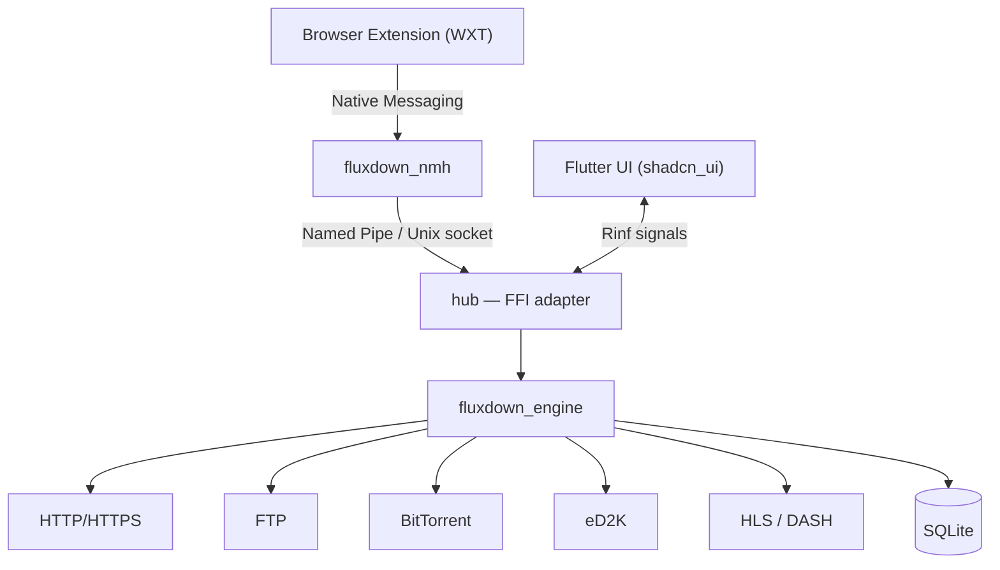

<div align="center">


# FluxDown

### Downloads, Supercharged.

*A blazing fast, multi-protocol download manager — the free & open-source IDM alternative.*

[](https://github.com/zerx-lab/FluxDown/releases/latest)
[](https://github.com/zerx-lab/FluxDown/releases)
[](LICENSE)
[](#installation)
[](native/engine)
[](lib)
[](https://glama.ai/mcp/servers/zerx-lab/FluxDown)

[**Website**](https://fluxdown.zerx.dev) · [**Download**](https://fluxdown.zerx.dev/#download) · [**Changelog**](https://fluxdown.zerx.dev/changelog) · [**FAQ**](https://fluxdown.zerx.dev/faq) · [**Feedback**](https://fluxdown.zerx.dev/feedback)

**English** | [简体中文](README.zh-CN.md)

</div>

---

## Highlights

- **Up to 10x faster** — Rust + Tokio engine with IDM-style dynamic segmentation
- **Multi-protocol** — HTTP/HTTPS, FTP, BitTorrent, eD2K, HLS & DASH streaming
- **Browser integration** — Chrome / Edge / Firefox extension with a 3-layer interception engine
- **AI-agent ready** — built-in MCP (Model Context Protocol) server: let Claude, Cursor & other AI clients manage your downloads
- **Resume anywhere** — full download state persisted in SQLite; survive crashes and reboots
- **Beautiful UI** — light/dark themes, 13 color schemes, responsive three-pane layout
- **Clean & private** — free and open source, no ads, no tracking, no account required, local-first

## Features

| Feature | Description |
|---|---|
| **Rust-Powered Engine** | Built on Rust and Tokio with zero-cost abstractions — memory-safe concurrency at maximum throughput |
| **Smart Segmentation** | Segments split dynamically at runtime; idle threads rescue slow segments, just like IDM — but smarter |
| **Multi-Protocol** | Dedicated engines for HTTP/HTTPS, FTP, BitTorrent (DHT/UPnP/magnet), eD2K (server + Kad DHT source finding, MD4 verification), HLS (AES-decrypt) and DASH |
| **Speed Control** | Token-bucket global rate limiting — download in the background without killing your browsing |
| **Resume Anywhere** | Every byte tracked in SQLite with WAL; power loss never costs you progress |
| **Browser Integration** | Three-layer download interception, streaming media sniffing, Alt+Click bypass, right-click send |
| **MCP Server** | Built-in Model Context Protocol endpoint (Streamable HTTP) with 9 tools — AI agents can add, monitor and control downloads |
| **Beautiful Interface** | shadcn-style widgets, IDM-style segment visualization, named queues, system tray |
| **Clean & Private** | Zero ads, zero telemetry lock-in, zero accounts — your data never leaves your machine |

## FluxDown vs. IDM

| | FluxDown | IDM |
|---|:---:|:---:|
| Price | **Free & open source** | $24.95 + renewals |
| Open source | Yes (AGPL-3.0) | No |
| Platforms | Windows / macOS / Linux / NAS / Android | Windows only |
| BitTorrent & magnet | Yes | No |
| eD2K / eMule links | Yes | No |
| HLS / DASH streaming | Yes | Partial |
| Dynamic segmentation | Yes | Yes |
| Browser extension | Chrome / Edge / Firefox | Yes |
| Ads & tracking | **None** | — |

## Installation

Grab the latest build from [**GitHub Releases**](https://github.com/zerx-lab/FluxDown/releases/latest) or [**fluxdown.zerx.dev**](https://fluxdown.zerx.dev/#download):

| Platform | Packages |
|---|---|
| **Windows** (x64 / ARM64) | `setup.exe` installer · portable `.zip` |
| **macOS** (Intel / Apple Silicon) | `.dmg` · portable `.tar.gz` |
| **Linux** (x64) | `.AppImage` · `.deb` · Arch `.pkg.tar.zst` · portable `.tar.gz` |
| **Android** (arm64-v8a / armeabi-v7a / x86_64) | per-ABI `.apk` · universal `.apk` |
| **NAS / Server** (headless, x64 / ARM64) | [Docker](https://ghcr.io/zerx-lab/fluxdown-server) · Synology DSM 6/7 `.spk` · QNAP `.qpkg` · OpenWrt `.ipk` · Unraid CA template · CasaOS / ZimaOS app store |

### Browser Extension

Install the extension so FluxDown takes over browser downloads automatically:

[](https://chromewebstore.google.com/detail/fluxdown/meleenglfggcmcajknpeeeiobnpfmahc)
[](https://microsoftedge.microsoft.com/addons/detail/fluxdown/nglkkjbogjghekbhhcnccnpfedjbdhhd)
[](https://addons.mozilla.org/firefox/addon/fluxdown)

## MCP Server (Model Context Protocol)

FluxDown ships a built-in **MCP server** so AI agents (Claude Desktop, Cursor, Cline, …) can manage downloads via the [Model Context Protocol](https://modelcontextprotocol.io). It speaks **Streamable HTTP** (JSON-RPC 2.0 over a single `POST /mcp`) on the local API port — no extra process needed.

- **Endpoint**: `http://127.0.0.1:17800/mcp` (local-only by default)
- **Auth**: Bearer token (`Authorization: Bearer <token>` or `X-FluxDown-Token`), shared with the management API
- **Enable**: Settings → API Service → toggle *MCP endpoint* (a token is generated automatically); the headless server enables it by default

### Tools (9)

| Tool | Description |
|---|---|
| `download_add` | Create a download task (HTTP/HTTPS, FTP, magnet, BitTorrent) |
| `download_list` | List tasks with progress/speed/status, optional status filter |
| `download_get` | Get a single task by ID |
| `download_pause` / `download_resume` | Pause / resume one task |
| `download_pause_all` / `download_resume_all` | Pause / resume all tasks |
| `download_remove` | Remove a task, optionally deleting downloaded files |
| `queue_list` | List named queues and their configuration |

### Client configuration

```json
{
  "mcpServers": {
    "fluxdown": {
      "url": "http://127.0.0.1:17800/mcp",
      "headers": { "Authorization": "Bearer <your-token>" }
    }
  }
}
```

The MCP layer is implemented in [`native/api/src/mcp.rs`](native/api/src/mcp.rs) on top of the same `ApiHost` trait that powers the REST management API and aria2-compatible JSON-RPC.

## Architecture

Flutter renders the UI; a zero-FFI Rust engine does the heavy lifting. The two talk through [Rinf](https://rinf.cunarist.org) signals, and the browser extension connects via Native Messaging.



| Layer | Tech | Path |
|---|---|---|
| UI | Flutter + shadcn_ui | [`lib/`](lib) |
| FFI bridge | Rinf (Dart ↔ Rust signals) | [`native/hub/`](native/hub) |
| Download engine | Rust + Tokio (zero FFI deps) | [`native/engine/`](native/engine) |
| Browser extension | WXT + TypeScript | [`fluxDown/`](fluxDown) |
| Website | Astro + React | [`website/`](website) |

## Building from Source

**Prerequisites**: [Flutter SDK](https://docs.flutter.dev/get-started/install) · [Rust toolchain](https://www.rust-lang.org/tools/install) · [Rinf CLI](https://rinf.cunarist.org)

```shell
# Check your environment
rustc --version
flutter doctor

# Install the Rinf CLI (once)
cargo install rinf_cli

# Fetch dependencies & generate Dart bindings
flutter pub get
rinf gen

# Run in debug mode
flutter run

# Build a release
flutter build windows --release   # or: macos / linux
```

<details>
<summary><b>Linux system dependencies</b></summary>

```shell
# Debian/Ubuntu
sudo apt-get install cmake ninja-build clang pkg-config \
  libgtk-3-dev libayatana-appindicator3-dev libnotify-dev libsecret-1-dev patchelf zstd

# Arch Linux
sudo pacman -S cmake ninja clang pkgconf gtk3 libayatana-appindicator libnotify libsecret patchelf zstd
```

The NMH relay binary (`fluxdown_nmh`) is built automatically by CMake during `flutter build`. Distribution packages (AppImage / deb / Arch / portable) are produced by [CI](.github/workflows/release.yml) on every tag.

</details>

<details>
<summary><b>Running tests</b></summary>

```shell
flutter test                          # Dart tests
cargo test -p fluxdown_engine        # Rust engine tests
cargo test -p hub                    # FFI adapter tests
```

</details>

## Contributing & Community

- **Bug reports / feature requests** — [GitHub Issues](https://github.com/zerx-lab/FluxDown/issues) or the in-app feedback dialog
- **QQ Group** — [832143651](https://fluxdown.zerx.dev/qq-group)

Pull requests are welcome! Before submitting, please make sure:

```shell
cargo fmt --check && cargo clippy -- -D warnings   # Rust
flutter analyze                                     # Dart
```

## License

Distributed under the [GNU Affero General Public License v3.0](LICENSE).

<div align="center">

**If FluxDown saves you time, consider giving it a Star — it helps more people discover the project.**

Made by [zerx-lab](https://github.com/zerx-lab)

</div>
