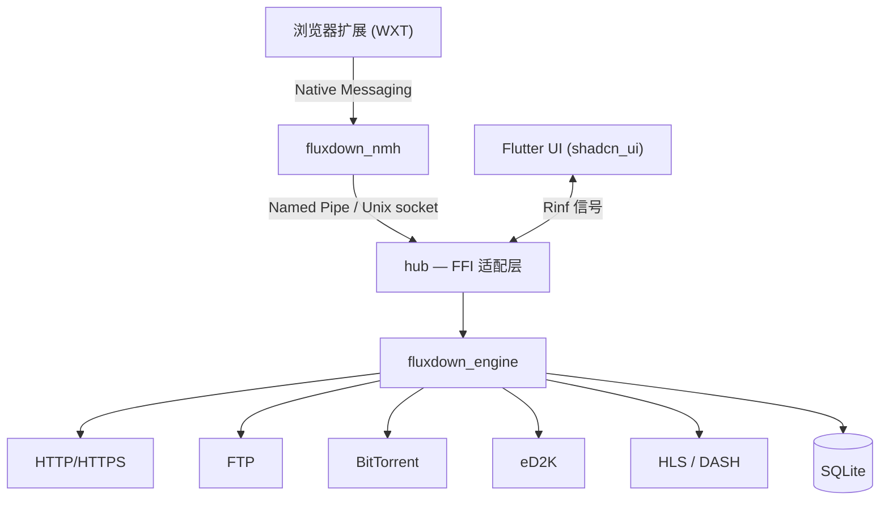

<div align="center">


# FluxDown

### 下载，全面加速。

*极速多协议下载管理器 —— 免费开源的 IDM 替代品。*

[](https://github.com/zerx-lab/FluxDown/releases/latest)
[](https://github.com/zerx-lab/FluxDown/releases)
[](LICENSE)
[](#安装)
[](native/engine)
[](lib)
[](https://glama.ai/mcp/servers/zerx-lab/FluxDown)

[**官网**](https://fluxdown.zerx.dev) · [**下载**](https://fluxdown.zerx.dev/#download) · [**更新日志**](https://fluxdown.zerx.dev/changelog) · [**常见问题**](https://fluxdown.zerx.dev/faq) · [**反馈**](https://fluxdown.zerx.dev/feedback)

[English](README.md) | **简体中文**

</div>

---

## 亮点

- **最高 10 倍提速** —— Rust + Tokio 引擎，IDM 式运行时动态分段
- **多协议支持** —— HTTP/HTTPS、FTP、BitTorrent、eD2K、HLS 与 DASH 流媒体
- **浏览器集成** —— Chrome / Edge / Firefox 扩展，三层下载拦截引擎
- **AI 智能体就绪** —— 内置 MCP（Model Context Protocol）服务器，Claude、Cursor 等 AI 客户端可直接管理下载
- **随处续传** —— 下载状态全量持久化到 SQLite，崩溃断电不丢进度
- **精美界面** —— 深浅主题、13 套配色、可调节三栏响应式布局
- **干净纯粹** —— 免费开源、零广告、零追踪、无需账号、本地优先

## 功能特性

| 特性 | 说明 |
|---|---|
| **Rust 驱动引擎** | 基于 Rust 与 Tokio 的零开销抽象 —— 内存安全的并发，榨干带宽 |
| **智能分段** | 运行时动态拆分分段，空闲线程接管慢速分段 —— 像 IDM，但更聪明 |
| **多协议** | HTTP/HTTPS、FTP、BitTorrent（DHT/UPnP/磁力）、eD2K（服务器 + Kad DHT 找源、MD4 校验）、HLS（AES 解密）、DASH 专属引擎 |
| **速度控制** | Token bucket 全局限速 —— 后台下载不影响正常上网 |
| **随处续传** | 每个字节都记录在 SQLite（WAL 模式），断电也不丢进度 |
| **浏览器集成** | 三层下载拦截、流媒体资源嗅探、Alt+Click 绕过、右键发送 |
| **MCP 服务器** | 内置 Model Context Protocol 端点（Streamable HTTP），9 个工具 —— AI 智能体可新建、监控、控制下载 |
| **精美界面** | shadcn 风格组件、IDM 式分段可视化、命名队列、系统托盘 |
| **干净纯粹** | 零广告、零追踪、无账号 —— 数据完全留在本地 |

## FluxDown vs. IDM

| | FluxDown | IDM |
|---|:---:|:---:|
| 价格 | **免费开源** | $24.95 + 续费 |
| 开源 | 是（AGPL-3.0） | 否 |
| 平台 | Windows / macOS / Linux / NAS / Android | 仅 Windows |
| BitTorrent 与磁力链 | 支持 | 不支持 |
| eD2K / eMule 链接 | 支持 | 不支持 |
| HLS / DASH 流媒体 | 支持 | 部分支持 |
| 动态分段 | 支持 | 支持 |
| 浏览器扩展 | Chrome / Edge / Firefox | 支持 |
| 广告与追踪 | **无** | — |

## 安装

从 [**GitHub Releases**](https://github.com/zerx-lab/FluxDown/releases/latest) 或 [**fluxdown.zerx.dev**](https://fluxdown.zerx.dev/#download) 获取最新版本：

| 平台 | 安装包 |
|---|---|
| **Windows**（x64 / ARM64） | `setup.exe` 安装程序 · 便携版 `.zip` |
| **macOS**（Intel / Apple Silicon） | `.dmg` · 便携版 `.tar.gz` |
| **Linux**（x64） | `.AppImage` · `.deb` · Arch `.pkg.tar.zst` · 便携版 `.tar.gz` |
| **Android**（arm64-v8a / armeabi-v7a / x86_64） | 分架构 `.apk` · 通用 `.apk` |
| **NAS / 服务器**（headless，x64 / ARM64） | [Docker](https://ghcr.io/zerx-lab/fluxdown-server) · 群晖 DSM 6/7 `.spk` · QNAP `.qpkg` · OpenWrt `.ipk` · Unraid CA 模板 · CasaOS / ZimaOS 应用商店 |

### 浏览器扩展

安装扩展后，FluxDown 会自动接管浏览器下载：

[](https://chromewebstore.google.com/detail/fluxdown/meleenglfggcmcajknpeeeiobnpfmahc)
[](https://microsoftedge.microsoft.com/addons/detail/fluxdown/nglkkjbogjghekbhhcnccnpfedjbdhhd)
[](https://addons.mozilla.org/zh-CN/firefox/addon/fluxdown)

## MCP 服务器（Model Context Protocol）

FluxDown 内置 **MCP 服务器**，AI 智能体（Claude Desktop、Cursor、Cline 等）可通过 [Model Context Protocol](https://modelcontextprotocol.io) 管理下载。采用 **Streamable HTTP**（单一 `POST /mcp` 上的 JSON-RPC 2.0），复用本机 API 端口，无需额外进程。

- **端点**：`http://127.0.0.1:17800/mcp`（默认仅本机可访问）
- **鉴权**：Bearer token（`Authorization: Bearer <token>` 或 `X-FluxDown-Token`），与管理 API 共用
- **开启方式**：设置 → API 服务 → 打开 *MCP 端点*（自动生成 token）；headless 服务器默认开启

### 工具（9 个）

| 工具 | 说明 |
|---|---|
| `download_add` | 新建下载任务（HTTP/HTTPS、FTP、磁力、BitTorrent） |
| `download_list` | 列出任务（含进度/速度/状态），可按状态过滤 |
| `download_get` | 按 ID 查询单个任务 |
| `download_pause` / `download_resume` | 暂停 / 恢复单个任务 |
| `download_pause_all` / `download_resume_all` | 暂停 / 恢复全部任务 |
| `download_remove` | 删除任务，可选同时删除磁盘文件 |
| `queue_list` | 列出命名队列及其配置 |

### 客户端配置

```json
{
  "mcpServers": {
    "fluxdown": {
      "url": "http://127.0.0.1:17800/mcp",
      "headers": { "Authorization": "Bearer <your-token>" }
    }
  }
}
```

MCP 层实现在 [`native/api/src/mcp.rs`](native/api/src/mcp.rs)，与 REST 管理 API、aria2 兼容 JSON-RPC 共用同一个 `ApiHost` trait。

## 架构

Flutter 负责渲染界面，零 FFI 依赖的 Rust 引擎负责下载。两端通过 [Rinf](https://rinf.cunarist.org) 信号通信，浏览器扩展经由 Native Messaging 接入。



| 层 | 技术栈 | 目录 |
|---|---|---|
| UI | Flutter + shadcn_ui | [`lib/`](lib) |
| FFI 桥接 | Rinf（Dart ↔ Rust 信号） | [`native/hub/`](native/hub) |
| 下载引擎 | Rust + Tokio（零 FFI 依赖） | [`native/engine/`](native/engine) |
| 浏览器扩展 | WXT + TypeScript | [`fluxDown/`](fluxDown) |
| 官网 | Astro + React | [`website/`](website) |

## 从源码构建

**前置要求**：[Flutter SDK](https://docs.flutter.dev/get-started/install) · [Rust 工具链](https://www.rust-lang.org/tools/install) · [Rinf CLI](https://rinf.cunarist.org)

```shell
# 检查环境
rustc --version
flutter doctor

# 安装 Rinf CLI（仅首次）
cargo install rinf_cli

# 拉取依赖并生成 Dart 绑定
flutter pub get
rinf gen

# 调试运行
flutter run

# 构建发行版
flutter build windows --release   # 或 macos / linux
```

<details>
<summary><b>Linux 系统依赖</b></summary>

```shell
# Debian/Ubuntu
sudo apt-get install cmake ninja-build clang pkg-config \
  libgtk-3-dev libayatana-appindicator3-dev libnotify-dev libsecret-1-dev patchelf zstd

# Arch Linux
sudo pacman -S cmake ninja clang pkgconf gtk3 libayatana-appindicator libnotify libsecret patchelf zstd
```

NMH 中继二进制（`fluxdown_nmh`）由 CMake 在 `flutter build` 时自动构建。发行包（AppImage / deb / Arch / 便携版）由 [CI](.github/workflows/release.yml) 在每次打 tag 时自动产出。

</details>

<details>
<summary><b>运行测试</b></summary>

```shell
flutter test                          # Dart 测试
cargo test -p fluxdown_engine        # Rust 引擎测试
cargo test -p hub                    # FFI 适配层测试
```

</details>

## 参与贡献与社区

- **Bug 反馈 / 功能建议** —— [GitHub Issues](https://github.com/zerx-lab/FluxDown/issues) 或应用内反馈对话框
- **QQ 群** —— [832143651](https://fluxdown.zerx.dev/qq-group)

欢迎提交 Pull Request！提交前请确保通过：

```shell
cargo fmt --check && cargo clippy -- -D warnings   # Rust
flutter analyze                                     # Dart
```

## 许可证

基于 [GNU Affero General Public License v3.0](LICENSE) 分发。

<div align="center">

**如果 FluxDown 帮你省下了时间，欢迎点个 Star —— 让更多人发现这个项目。**

Made by [zerx-lab](https://github.com/zerx-lab)

</div>
